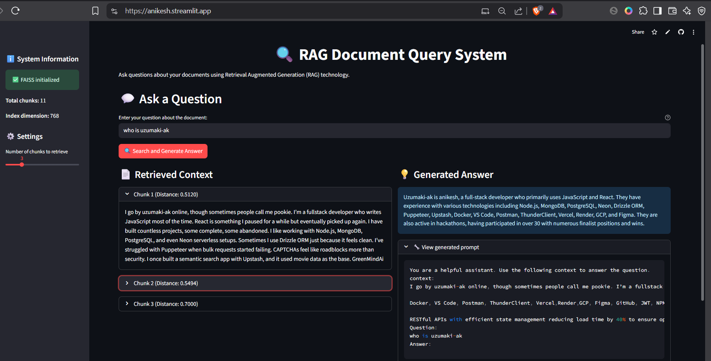

 

## Features

- 📄 **Document Processing**: Automatic chunking of large texts
- 🔍 **Semantic Search**: FAISS-based vector similarity search
- 🤖 **AI Responses**: Gemini API-powered answer generation
- 🎨 **Web Interface**: Streamlit-based interactive UI
- 💾 **Persistence**: Saved FAISS index for faster subsequent loads

## Project Structure
RAG1/
├── data/
│ └── unstructured-data.txt # Your document data
├── faiss_store/ # FAISS index storage
│ ├── index.faiss # Vector index
│ └── chunk_mapping.pkl # Chunk-text mapping
├── utils/
│ ├── chunking.py # Text splitting utilities
│ ├── embedding.py # Gemini embedding functions
│ ├── prompt.py # Prompt building utilities
│ └── completion.py # Answer generation functions
├── app.py # Main Streamlit application
├── console_app.py # Console version alternative
├── cleanup.py # FAISS cleanup utility
├── diagnose.py # Diagnostic tool
└── requirements.txt # Python dependencies


# app demo



## Quick Start

1. **Install dependencies**:
   ```bash
   pip install -r requirements.txt
   streamlit run app.py

   # Usage
Open the web interface at http://localhost:8501

Enter your question in the text input

Click "Search and Generate Answer"

View retrieved context and AI-generated response

# Clean corrupted files
python cleanup.py

# Run diagnostics
python diagnose.py

# Force reinitialize in the web app
Click "Force Reinitialize FAISS Index" button
GEMINI_API_KEY = "your_actual_api_key_here"


